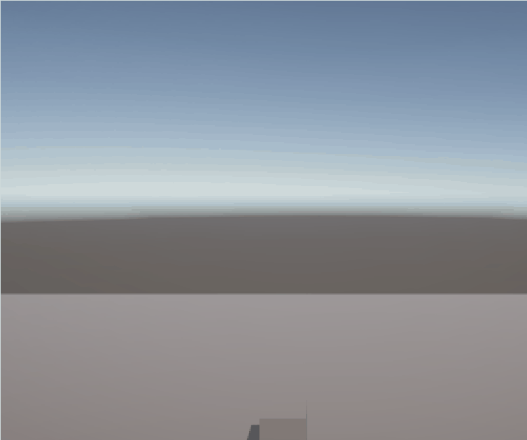

### hallo

# jump

ik heb hier de tor 0 geddan en laat een cube jumpen
[script](Assets/jump.cs)

# animation 

ik heb de animatie laten werkenen

[script](Assets/animator.cs)

# beweeg animatie

ik heb triggers gemaakt voor als je loopt zodat de animatie afspeeld

[script](Assets/animator.cs)

# jump

in deze gif heb ik de jump met mijn andere dingen laaten werken en gezoord dat hij op de grond moet zijn.
ik heb ook unieke matriaal gemaakt

[script](Assets/jump.cs)

# COIN

ik heb hier het coin systeem gemaakt met een particle system

[script](Assets/coin.cs)

# bullet

ik kwam er niet meer uit

[script](Assets/bullet.cs)

